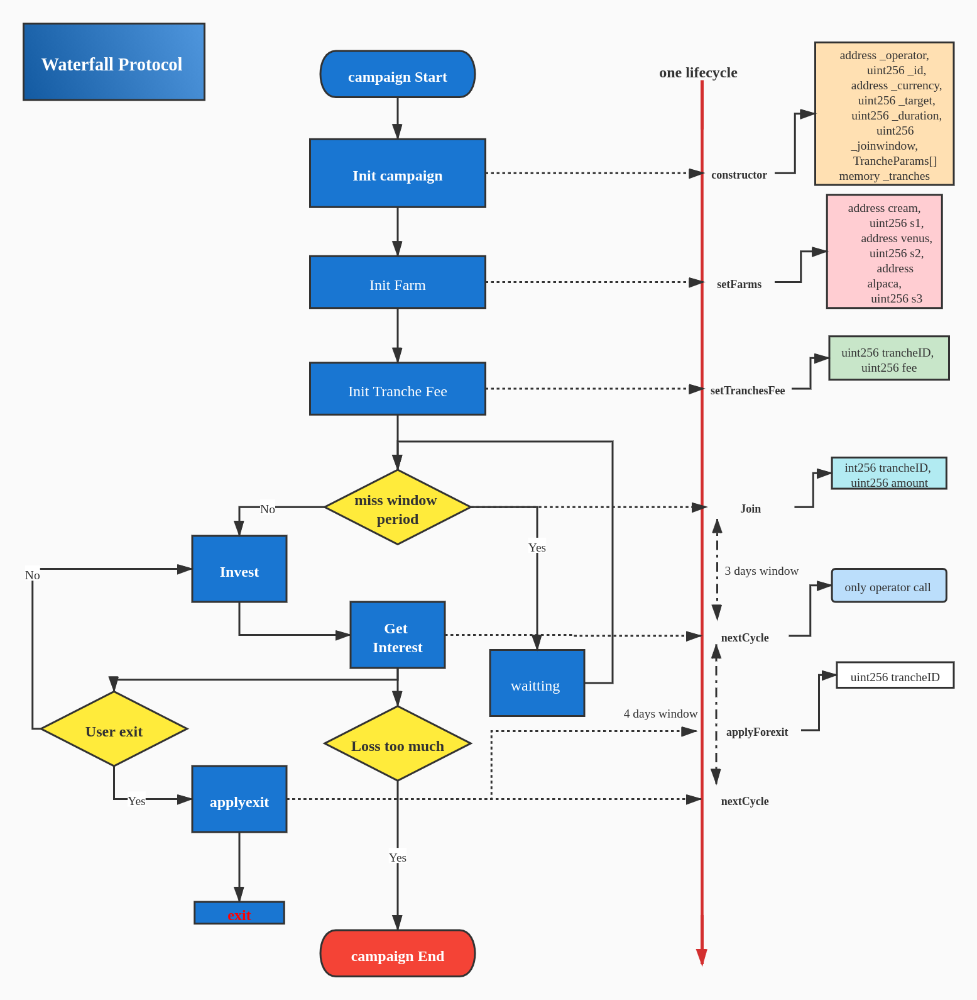

# Waterfall Contract Protocol

## 1. Introduction

## 2. How it works

This smart contract is Waterfall core protocol.

### 2.1 Campaign

`CampaignContinusCyscle.sol` is a vital contract in the project.

#### How it works

This smart contract allows to get deploy a campaign, and in this campaign you cant set diffierent farms and fee.
As users, you can invest this campaigm via `join` function, other function how to work, you can find above text:

**Operator**:

- //address -> uint256;<br>
  // address : cream and venus and alpaca farms <br>
  **Step 1**: setFarms(address, uint256, address uint256, address, uint256)
- // uint256:trancheid; uint256 tranche fee<br>
  // for extention params: a pait of to set;<br>
  **Step 2**: setTrancheFee(uint256, uint256)
- // await 7 day or other time you can call this funcion<br>
  **Step 3**: nextCycle();
- // withdraw operator interest<br>
  // param: uint256: operatorBalance: operatorBalance is a public param in the contract,can easy get.<br>
  **Step 4**: withdrawFee(uint256)

<hr>

**User**

- // invest your amount into campaign by function join in the 3 days window period;<br>
  // params: tranche id and invest amount;<br>
  **Step 1** : join(uint256, uint256)
- // if you want to exit,first call funcion applyForExit, and will exit in the end of nextCycle<br>
  // param: uint256: exit tranche id: if you are not in current thanche will err;<br>
  **Step 2**: applyForExit(uint256)
- // if you want to exit, second call funcion exit;<br>
  //param: uint256 is tranche id;<br>
  **Step 3**: exit(uint256)

**List of Farm (name and address)**

|    NAME    |                  ADDRESS                   |
| :--------: | :----------------------------------------: |
|   Cream    | 0xb316F4F692d3bc53B79C83c97fDD45bC94255F53 |
|   Venus    | 0x95c78222B3D6e262426483D42CfA53685A67Ab9D |
| AlpacaFarm | 0x7C9e73d4C71dae564d41F78d56439bB4ba87592f |

**List of Other contract address**

|    name     |                  ADDRESS                   |
| :---------: | :----------------------------------------: |
|    BUSD     | 0xe9e7CEA3DedcA5984780Bafc599bD69ADd087D56 |
| AlpacaToken | 0x7752e1FA9F3a2e860856458517008558DEb989e3 |
|   Pancake   | 0x10ED43C718714eb63d5aA57B78B54704E256024E |

**List of Waterfall project contract**

#### Waterfall one lifecycle figure



#### Other important ideology

**About fee**
if the profit ist greater than zero, we will charge intesest; if the return is less than zero, we will not charge any interest.
But believe in the power of our team.

## TEST

### Test contract

|     Param     |                     Decription                     |
| :-----------: | :------------------------------------------------: |
| Contract path |     0x4BB0E638dd27b6963Bb162c014e1E8047Ae23028     |
|     Path      |    v2Test/contract/CampaignContinusCyscleTest01    |
| contract name |            CampaignContinusCyscleTest01            |
|    network    |                   Biance_testnet                   |
| abi file path | v2Test/contract/CampaignContinusCyscles-deploy.abi |
|               |                                                    |

### Before deploying campaign contracts

you need to deploy wtf token, RewardFactory, TrancheTokenFactory contracts first.

- `faucet` in WTF deployment is the address who will receive all the WTF once the token contract deployed.
- 2 factory contracts have no constructor arguments.

```javascript
const wtf = await WTF.deploy("WTF", "WTF", faucet, D18.mul(1000000000));
const rewardFactory = await RewardFactory.deploy();
const trancheTokenFactory = await TrancheTokenFactory.deploy();
```

### Deploy contract params set (construct)

args of contructor have been listed below:

```solidity
    constructor(
        address _operator,
        uint256 _id,
        string memory _campaignName,
        address _WTF,
        address _rewardFactory,
        address _trancheTokenFactory,
        address _currency,
        uint256 _target,
        uint256 _duration,
        uint256 _joinwindow
    ) public {
    ...
    }
```

example:

```javascript
let camp = await Camp.deploy(
  operator.address,
  0,
  "",
  wtf.address,
  rewardFactory.address,
  trancheTokenFactory.address,
  BUSD.address,
  D18.mul(1000000),
  86400 * 7,
  86400 * 1
);
```

### You can set tranche fee below

all params have 10\*\*5 decimals, `0.033% = 33`.

```shell
Senior = 0.033%   => 33
Mezz   = 0.05%    => 50
Junior = 0.2%     => 200
```
